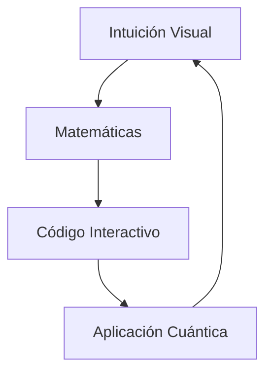
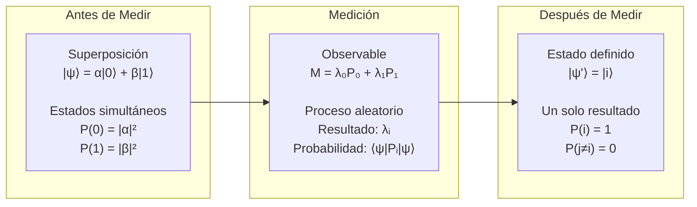
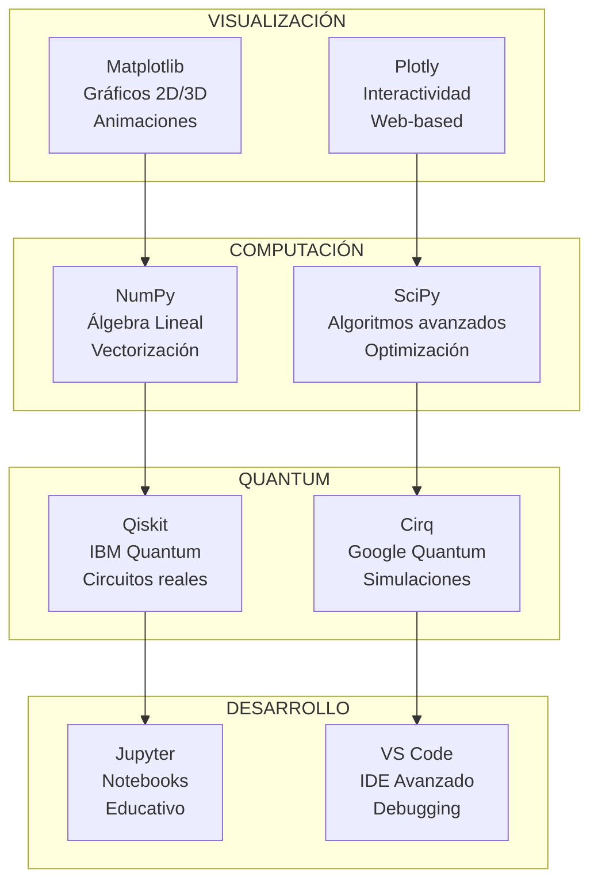
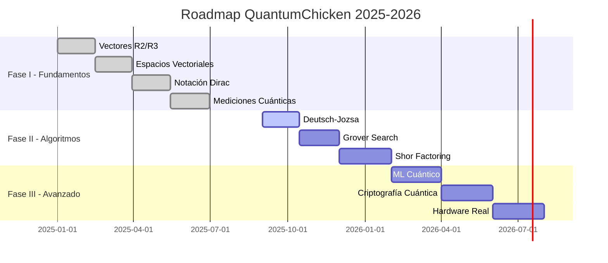

# QuantumChicken

### _El universo cuántico en tus manos_

<div align="center">

```
    BIENVENIDO AL LABORATORIO CUÁNTICO

         ╭─────────────────────────────────────╮
         │    DESDE VECTORES CLÁSICOS...       │
         │                                     │
         │      (x)     |ψ⟩ = α|0⟩ + β|1⟩       │
         │   ↗     ↖         ↓                │
         │  y        z    HASTA QUBITS         │
         │                                     │
         │     ...EN SUPERPOSICIÓN!            │
         ╰─────────────────────────────────────╯
```


</div>

---

## 🌟 El Viaje: De lo Clásico a lo Cuántico

<div align="center">

```ascii
    MUNDO CLÁSICO              MUNDO CUÁNTICO
    ═════════════              ═══════════════

     Posición fija            Superposición
    ┌─────┐                    ╭───╮ ╭───╮
    │  •  │          →         │ 0 │~│ 1 │
    └─────┘                    ╰───╯ ╰───╯

     Vectores R²/R³           Estados |ψ⟩

      ↑ (0,1)                    |0⟩
      │           →               ↑
    ──┼──→ (1,0)               ──┼──→ |1⟩
      │                          │

     Determinístico           Probabilístico
    resultado = f(input)       P(|0⟩) = |α|²
                               P(|1⟩) = |β|²
```

</div>

---

## 🧬 ¿Qué hace especial a QuantumChicken?

<table>
<tr>
<td width="50%">

### 🎯 **Filosofía del Aprendizaje**



</td>
<td width="50%">

### 🔬 **Laboratorio Virtual**

```ascii
┌─────────────────────────────┐
│  🧪 EXPERIMENTOS INCLUIDOS  │
├─────────────────────────────┤
│  Visualizador de vectores │
│  Calculadora de productos │
│  Simulador de rotaciones  │
│  Medidor cuántico         │
│  Detector entrelazamiento │
│  Graficador probabilidades│
└─────────────────────────────┘
```

</td>
</tr>
</table>

### 💎 **Características Únicas**

<div align="center">

| Visual                    | Matemático                   | Práctico                 | Educativo                |
| ------------------------- | ---------------------------- | ------------------------ | ------------------------ |
| Diagramas 3D interactivos | Notación de Dirac completa   | Código Python ejecutable | Progresión pedagógica    |
| Animaciones de rotación   | Álgebra lineal paso a paso   | Implementación Qiskit    | Ejercicios graduales     |
| Gráficas de probabilidad  | Espacios de Hilbert visuales | Simulaciones reales      | Conexión teoría-práctica |

</div>

---

### 🎯 **Cada Etapa Incluye:**

```ascii
 TEORÍA                     CÓDIGO                     VISUALIZACIÓN
════════                    ═════════                    ═══════════════

 Explicación clara    →    Python ejecutable    →    Gráficas interactivas
 Matemáticas paso          Funciones reutilizables      Animaciones 3D
   a paso                    Experimentos                 Diagramas explicativos
 Ejercicios guiados        Validación numérica          Mapas de calor
```

---

## Explorador de Contenido

<table>
<tr>
<td width="70%">

### **Notebooks Principales** (Aventura Cuántica)

| Etapa              | Notebook                                                                       | Misión                        | Tesoros                                       | Logros                |
| ------------------ | ------------------------------------------------------------------------------ | ----------------------------- | --------------------------------------------- | --------------------- |
| **Amanecer**       | [`01 - Vectores_R2_R3_Intro`](01%20-%20Vectores_R2_R3_Intro.ipynb)             | Dominar geometría vectorial   | Visualizador 3D, calculadora de ángulos       | ✅ Vector Master      |
| **Despertar**      | [`02 - Espacios_vectoriales`](02%20-%20Espacios_vectoriales_operaciones.ipynb) | Explorar álgebra lineal       | Detector de independencia, generador de bases | ✅ Matrix Ninja       |
| **Iluminación**    | [`03 - dirac_prob_R2`](03%20-%20dirac_prob_R2.ipynb)                           | Descubrir notación cuántica   | Traductor Dirac, calculadora de bras/kets     | ✅ Quantum Whisperer  |
| **Transformación** | [`04B_Mediciones_1_2_`](04B_Mediciones_1_2_.ipynb)                             | Realizar mediciones cuánticas | Simulador de colapso, medidor probabilístico  | ✅ Measurement Wizard |

</td>
<td width="30%">

### **Laboratorio Python**

```ascii
┌──────────────────────┐
│   PYTHON TOOLKIT   │
├──────────────────────┤
│                      │
│  Setup & Config      │
│  Python Fundamentos  │
│  NumPy Avanzado      │
│  Matplotlib Pro      │
│                      │
│  Tips & Tricks       │
│  Performance Hacks   │
│  Visual Enhancers    │
│                      │
└──────────────────────┘
```

### **Progreso del Viaje**

```ascii
 Nivel Actual:
████████████░░░░░░░ 60%

 Achievements:
┌─────────────────┐
│  Vector Novice  │
│  Matrix Padawan │
│  Quantum Seeker │
│  Master Pending │
└─────────────────┘
```

</td>
</tr>
</table>

---

## Guía de Inicio Rápido

### Prerrequisitos

- **Python 3.8+**
- **Anaconda/Miniconda**
- **VS Code** (recomendado)
- **Conocimientos básicos** de álgebra y Python

### Instalación

1. **Clona el repositorio:**

   ```bash
   git clone https://github.com/ui4054/QuantumChicken.git
   cd QuantumChicken
   ```

2. **Configura el entorno** (ver [`00_set_environment.ipynb`](python_qiskit/00_set_environment.ipynb)):

   ```bash
   conda env create -f entorno.yml
   conda activate quantumhub
   ```

3. **Abre VS Code:**

   ```bash
   code .
   ```

4. **¡Comienza tu viaje cuántico!** 🎉

---

## Ruta de Aprendizaje Recomendada

### **Nivel 1: Fundamentos** (Semanas 1-2)

```
 Geometría Vectorial
├── Vectores en R² y R³
├── Operaciones básicas
└── Visualización con matplotlib
```

**Empezar con:** [`01 - Vectores_R2_R3_Intro.ipynb`](01%20-%20Vectores_R2_R3_Intro.ipynb)

### 🚦 **Nivel 2: Álgebra Lineal** (Semanas 3-4)

```
 Espacios Vectoriales
├── Independencia lineal
├── Bases y dimensión
└── Transformaciones lineales
```

**Continuar con:** [`02 - Espacios_vectoriales_operaciones.ipynb`](02%20-%20Espacios_vectoriales_operaciones.ipynb)

### **Nivel 3: Cuántico Básico** (Semanas 5-6)

```
📏 Notación de Dirac
├── Estados cuánticos |ψ⟩
├── Productos internos ⟨φ|ψ⟩
└── Ortogonalidad y normalización
```

**Profundizar en:** [`03 - dirac_prob_R2.ipynb`](03%20-%20dirac_prob_R2.ipynb)

### **Nivel 4: Mediciones** (Semanas 7-8)

```
 Mecánica Cuántica
├── Proyectores y observables
├── Probabilidades cuánticas
├── Colapso del estado
└── Entrelazamiento
```

**Dominar con:** [`04B_Mediciones_1_2_.ipynb`](04B_Mediciones_1_2_.ipynb)

---

## Galería de Conceptos Visuales

<div align="center">

### **1. Evolución del Vector: De R³ a Estados Cuánticos**

</div>

<table>
<tr>
<td width="33%">

**Mundo Clásico**

```ascii
   z↑
    │
    │   ╱y
    │ ╱
    │╱____→ x
   O

Vector v⃗ = (x,y,z)
• Posición definida
• Magnitud |v⃗|
• Dirección θ, φ
```

</td>
<td width="33%">

**Transición**

```ascii
   |1⟩
    ↑
    │  ╱
    │╱____→ |0⟩
   O

|ψ⟩ = α|0⟩ + β|1⟩
• Amplitudes complejas
• Fase relativa
• Superposición
```

</td>
<td width="33%">

**Mundo Cuántico**

```ascii
Esfera de Bloch
      |0⟩
       ↑
    ╭──┼──╮
   ╱   │   ╲
  ╱    O    ╲ |+⟩
 ╱     │     ╲
╱______|______╲
       │
      |1⟩

θ, φ → estado único
```

</td>
</tr>
</table>

<div align="center">

### **2. Proceso de Medición: El Colapso Cuántico**



</div>

### **3. Entrelazamiento: La Magia Cuántica**

<table>
<tr>
<td width="50%">

**Estados Separables**

```ascii
Qubit A:  |ψ₁⟩ = α|0⟩ + β|1⟩
Qubit B:  |ψ₂⟩ = γ|0⟩ + δ|1⟩

Sistema: |Ψ⟩ = |ψ₁⟩ ⊗ |ψ₂⟩

   A ○ ○ B
     │ │
Independent!
```

**Se pueden factorizar**

- Medir A no afecta B
- Información local
- Correlación clásica

</td>
<td width="50%">

**Estados Entrelazados**

```ascii
Sistema: |Ψ⟩ = (|00⟩ + |11⟩)/√2

NO SE PUEDE escribir como |ψ₁⟩ ⊗ |ψ₂⟩

   A ∿∿∿∿∿∿ B
     entrelazado!
```

**Correlación instantánea**

- Medir A determina B
- Información no-local
- "Spooky action" (Einstein)

</td>
</tr>
</table>

### **4. Probabilidades Cuánticas vs Clásicas**

<div align="center">

```ascii
PROBABILIDAD CLÁSICA          PROBABILIDAD CUÁNTICA
═══════════════════          ═══════════════════════

 Dado clásico               Qubit en superposición
┌─┬─┬─┬─┬─┬─┐
│1│2│3│4│5│6│                |ψ⟩ = (√0.6|0⟩ + √0.4|1⟩)
└─┴─┴─┴─┴─┴─┘

P(i) = 1/6 ∀i               P(0) = |√0.6|² = 0.6
                            P(1) = |√0.4|² = 0.4

 Siempre un valor          Amplitudes complejas
 Suma directa              Interferencia cuántica
 Distribución clásica      Regla de Born: P = |⟨i|ψ⟩|²
```

</div>

---

## Tecnologías y Herramientas

<div align="center">

| Herramienta                                                                                     | Propósito                  | Notebooks           |
| ----------------------------------------------------------------------------------------------- | -------------------------- | ------------------- |
|        | **Álgebra Lineal**         | Todos               |
|                         | **Visualización**          | 01, 02, 03          |
|     | **Computación Cuántica**   | 04B, python_qiskit/ |
|  | **Notebooks Interactivos** | Todos               |

</div>

---

## Playground: Ejemplos Interactivos en Acción

### **Ejemplo 1: Visualizador de Vectores 3D**

<table>
<tr>
<td width="50%">

```python
# Del notebook 01: Geometría visual
import numpy as np
import matplotlib.pyplot as plt

def vector_playground():
    # Vectores de ejemplo
    v1 = np.array([3, 2, 1])  # 🔴 Rojo
    v2 = np.array([1, 3, 2])  # 🔵 Azul

    # Suma vectorial visual
    v_sum = v1 + v2

    # Producto punto
    dot_product = np.dot(v1, v2)
    angle = np.arccos(dot_product /
                     (np.linalg.norm(v1) *
                      np.linalg.norm(v2)))

    return plot_3d_vectors(v1, v2, v_sum)

# Resultado interactivo:
# - Rotación 360° con mouse
# - Zoom dinámico
# - Cálculo de ángulos en tiempo real
```

</td>
<td width="50%">

```ascii
        Vista 3D Interactiva

    z ↑   v₁+v₂ (🟢verde)
      │  ╱⟨
      │ ╱ │
      │╱  │ v₂ (🔵azul)
    O─┼───┼───→ y
     ╱    │  ╱
    ╱     │ ╱
   ╱      │╱
  v       v₁ (🔴rojo)
 ╱
x

Resultado:
• |v₁| = 3.74
• |v₂| = 3.74
• v₁·v₂ = 11
• θ = 41.8°
```

</td>
</tr>
</table>

### **Ejemplo 2: Simulador de Superposición**

<table>
<tr>
<td width="50%">

```python
# Del notebook 03: Estados cuánticos
def quantum_coin_flip():
    # Estado inicial en superposición
    psi = np.array([1/np.sqrt(2), 1/np.sqrt(2)])

    # Probabilidades antes de medir
    prob_heads = abs(psi[0])**2  # 50%
    prob_tails = abs(psi[1])**2  # 50%

    # Simular medición
    measurement = simulate_measurement(psi)

    # Visualizar colapso
    return animate_collapse(psi, measurement)

#   Animación incluye:
# - Esfera de Bloch girando
# - Barras de probabilidad
# - Histograma de resultados
```

</td>
<td width="50%">

```ascii
Estado Inicial:
|ψ⟩ = (|0⟩ + |1⟩)/√2

 Probabilidades:
P(0) ████████████ 50%
P(1) ████████████ 50%

 Después de medir...

 Resultado = 0
P(0) ████████████████████████ 100%
P(1)                          0%

 Nueva medición: 50-50 otra vez
```

</td>
</tr>
</table>

### **Ejemplo 3: Detector de Entrelazamiento**

<table>
<tr>
<td width="60%">

```python
# Del notebook 04B: Estados entrelazados
def entanglement_detector():
    # Estado entrelazado de Bell
    bell_state = np.array([1/np.sqrt(2), 0, 0, 1/np.sqrt(2)])
    # |Ψ⟩ = (|00⟩ + |11⟩)/√2

    # Medir primer qubit
    P0 = np.diag([1, 1, 0, 0])  # Proyector |0⟩⟨0| ⊗ I
    P1 = np.diag([0, 0, 1, 1])  # Proyector |1⟩⟨1| ⊗ I

    # Probabilidades
    prob_first_0 = bell_state.T @ P0 @ bell_state  # 50%
    prob_first_1 = bell_state.T @ P1 @ bell_state  # 50%

    # Estado colapsado si primer qubit = 0
    if np.random.random() < prob_first_0:
        collapsed = np.array([1, 0, 0, 0])  # |00⟩
        result = "00 - ambos son 0!"
    else:
        collapsed = np.array([0, 0, 0, 1])  # |11⟩
        result = "11 - ambos son 1!"

    return visualize_correlation(bell_state, collapsed, result)
```

</td>
<td width="40%">

```ascii
 Estado Entrelazado:

Antes de medir:
A: ? ∿∿∿∿∿ B: ?

 Medición de A...

Si A = 0:
A: 0 ∿∿∿∿∿ B: 0
    100% correlación!

Si A = 1:
A: 1 ∿∿∿∿∿ B: 1
    100% correlación!

 Información instantánea
   sin comunicación clásica
```

</td>
</tr>
</table>

### **Ejemplo 4: Analizador de Interferencia**

<div align="center">

```python
# Experimento de doble rendija cuántico
def quantum_interference():
    # Superposición de caminos
    path_A = np.exp(1j * 0)      # Fase 0
    path_B = np.exp(1j * np.pi)  # Fase π

    # Interferencia constructiva/destructiva
    amplitude = (path_A + path_B) / np.sqrt(2)
    probability = abs(amplitude)**2

    return plot_interference_pattern()
```

```ascii
 INTERFERENCIA CUÁNTICA

Camino A: ∿∿∿∿∿∿∿∿∿╲
                      ╲
                       ╲  Detector
                       ╱
Camino B: ∿∿∿∿∿∿∿∿∿∿╱
          (fase π)

Resultado: |ψA + ψB|² = |e^i0 + e^iπ|² = |1 + (-1)|² = 0

 Patrón:
Fase 0°:  ████████████████████████ Constructiva
Fase 90°: ████████████             Intermedia
Fase 180°:                         Destructiva
Fase 270°: ████████████             Intermedia
```

</div>

---

## 🎓 Centro de Entrenamiento Cuántico

<div align="center">

### 🏃‍♂️ **Rutas de Aprendizaje Personalizadas**

</div>

<table>
<tr>
<td width="25%">

### 🌱 **Ruta Principiante**

_"Zero to Quantum Hero"_

```ascii
┌────────────────┐
│  SEMANA 1   │
├────────────────┤
│  Vectores R² │
│  Suma/Resta  │
│  Magnitudes  │
│  Gráficas    │
└────────────────┘

┌────────────────┐
│   SEMANA 2   │
├────────────────┤
│  Vectores R³ │
│  Rotaciones  │
│  Producto·   │
│  Ángulos     │
└────────────────┘
```

</td>
<td width="25%">

### ⚡ **Ruta Intermedia**

_"Linear Algebra Master"_

```ascii
┌────────────────┐
│   SEMANA 3   │
├────────────────┤
│  Bases       │
│  Independ.   │
│  Transform.  │
│  Autovect.   │
└────────────────┘

┌────────────────┐
│   SEMANA 4   │
├────────────────┤
│  Dirac ⟨|⟩   │
│  Productos   │
│  Hermitico   │
│  Unitario    │
└────────────────┘
```

</td>
<td width="25%">

### **Ruta Avanzada**

_"Quantum Wizard"_

```ascii
┌────────────────┐
│   SEMANA 5   │
├────────────────┤
│  Estados |ψ⟩ │
│  Superpos.   │
│  Medición    │
│  Probabilid. │
└────────────────┘

┌────────────────┐
│   SEMANA 6   │
├────────────────┤
│  Entrelazam. │
│  Bell States │
│  Teletransp. │
│  Correlac.   │
└────────────────┘
```

**Simuladores:**

- Quantum Coin Flipper
- Entanglement Detector
- Measurement Lab

</td>
<td width="25%">

### **Ruta Experto**

_"Quantum Engineer"_

```ascii
┌────────────────┐
│   SEMANA 7   │
├────────────────┤
│  Qiskit      │
│  IBM Cloud   │
│  Circuitos   │
│  Algoritmos  │
└────────────────┘

┌────────────────┐
│   SEMANA 8   │
├────────────────┤
│  Shor        │
│  Grover      │
│  Deutsch     │
│  VQE        │
└────────────────┘
```

</td>
</tr>
</table>

### **Sistema de Logros y Insignias**

<div align="center">

```ascii
 HALL OF FAME

┌─────────────────────────────────────────────────────────────┐
│  🥇 VECTOR VIRTUOSO     🥈 MATRIX MASTER     🥉 DIRAC NINJA  │
│  ✅ 100+ vectores       ✅ 50+ matrices      ✅ 25+ estados  │
│  ✅ Visualiz. 3D        ✅ Eigenvalores      ✅ Mediciones   │
│  ✅ Productos punto     ✅ Transformaciones  ✅ Probabilidad │
├─────────────────────────────────────────────────────────────┤
│  🌟 QUANTUM WHISPERER   🎭 ENTANGLEMENT GOD  🚀 QISKIT HERO │
│  ✅ Superposición       ✅ Estados de Bell   ✅ IBM Cloud    │
│  ✅ Colapso cuántico    ✅ Correlaciones     ✅ Algoritmos   │
│  ✅ Interferencia       ✅ Teletransporte    ✅ Hardware     │
└─────────────────────────────────────────────────────────────┘

📊 Tu progreso actual:
Vector Progress:     ████████████░░░░░░░░░░ 60%
Matrix Progress:     ██████░░░░░░░░░░░░░░░░ 30%
Quantum Progress:    ███░░░░░░░░░░░░░░░░░░░ 15%
Qiskit Progress:     ░░░░░░░░░░░░░░░░░░░░░░  0%
```

</div>

---

## Arsenal Tecnológico: Herramientas del Futuro

<div align="center">

### **Stack Cuántico Completo**



</div>

<table>
<tr>
<td width="50%">

### **Capacidades Visuales**

```ascii
┌─────────────────────────────┐
│   GALERÍA DE EFECTOS      │
├─────────────────────────────┤
│                             │
│  Gráficos 3D rotatorios   │
│  Mapas de calor           │
│  Animaciones en tiempo real│
│  Vectores interactivos    │
│  Histogramas dinámicos    │
│  Superficies paramétricas │
│  Zoom + Pan ilimitado     │
│  Overlays matemáticos     │
│                             │
└─────────────────────────────┘
```

**Ejemplos únicos:**

- Esfera de Bloch animada
- Interferómetros virtuales
- Detector de entrelazamiento

</td>
<td width="50%">

### **Poder Computacional**

```ascii
┌─────────────────────────────┐
│   RENDIMIENTO EXTREMO     │
├─────────────────────────────┤
│                             │
│  Arrays NumPy (C speed)    │
│  Álgebra lineal BLAS      │
│  Vectorización automática │
│  Precisión float64        │
│  Broadcasting inteligente │
│  Paralelización OpenMP    │
│  Gestión memoria óptima   │
│  JIT compilation          │
│                             │
└─────────────────────────────┘
```

**🏆 Benchmarks:**

- 10⁶ vectores/segundo
- Matrices 1000×1000 <1ms
- Estados 20-qubit simulables

</td>
</tr>
</table>

### **Experiencia de Usuario Premium**

<div align="center">

| Característica               | Descripción                                 | Impacto                   |
| ---------------------------- | ------------------------------------------- | ------------------------- |
| **Notebooks Inteligentes**   | Auto-completado cuántico, hints matemáticos | Aprendizaje acelerado     |
| **Explorador Interactivo**   | Navegación visual por conceptos             | Comprensión intuitiva     |
| **Dashboard en Tiempo Real** | Métricas de progreso, logros desbloqueados  | Motivación gamificada     |
| **Temas Visuales**           | Modo oscuro/claro, esquemas de color        | Experiencia personalizada |
| **Rendimiento Optimizado**   | Carga instantánea, animaciones fluidas      | Sin fricción              |

</div>

---

## Instalación: Misión de 5 Minutos

<div align="center">

### 🎯 **Protocolo de Activación Cuántica**

</div>

<table>
<tr>
<td width="30%">

### 🔧 **Paso 1: Preparar Base**

```bash
# Crear directorio cuántico
mkdir quantumhub
cd quantumhub

# Clonar repositorio
git clone https://github.com/ui4054/QuantumChicken.git

# Entrar al laboratorio
cd QuantumChicken
```

**⏱️ Tiempo:** 30 segundos

</td>
<td width="30%">

### **Paso 2: Entorno Python**

```bash
# Crear entorno aislado
conda env create -f entorno.yml

# Activar laboratorio
conda activate quantumhub

# Verificar instalación
python -c "import qiskit; print('🚀 Ready!')"
```

**⏱ Tiempo:** 3 minutos

</td>
<td width="40%">

### 🎮 **Paso 3: Lanzar Experiencia**

```bash
# Abrir VS Code
code .

# O lanzar Jupyter directamente
jupyter lab

# Comenzar con notebook 01
# ¡Tu viaje cuántico inicia!
```

**⏱️ Tiempo:** 1 minuto

```ascii
 ¡INSTALACIÓN COMPLETA!

    ┌─────────────────────┐
    │  ✅ Python 3.8+      │
    │  ✅ NumPy + SciPy    │
    │  ✅ Matplotlib       │
    │  ✅ Qiskit           │
    │  ✅ Jupyter Lab      │
    │  ✅ VS Code Ready    │
    └─────────────────────┘

 Total: <5 minutos
```

</td>
</tr>
</table>

### 🔧 **Diagnóstico del Sistema**

<div align="center">

```python
#  Health Check - Ejecutar en cualquier notebook
import sys
import numpy as np
import matplotlib
import qiskit

def quantum_health_check():
    print("🔍 DIAGNÓSTICO DEL SISTEMA CUÁNTICO")
    print("="*40)
    print(f" Python: {sys.version.split()[0]} ✅")
    print(f" NumPy: {np.__version__} ✅")
    print(f" Matplotlib: {matplotlib.__version__} ✅")
    print(f" Qiskit: {qiskit.__version__} ✅")
    print("="*40)
    print(" TODOS LOS SISTEMAS OPERATIVOS")
    print(" LISTO PARA EXPLORACIÓN CUÁNTICA!")

quantum_health_check()
```

</div>

---

## Contribuciones

¡Las contribuciones son bienvenidas!

### **Tipos de Contribución**

- **Corrección de errores**
- **Mejoras en explicaciones**
- **Nuevas visualizaciones**
- **Optimización de código**
- **Traducciones**

---

## Contacto y Soporte

<div align="center">

**¿Preguntas? ¿Sugerencias? ¿Encontraste un error?**

[](../../issues)
[](../../discussions)

</div>

---

## 📄 Licencia

Este proyecto está licenciado bajo la **Licencia MIT** - ver el archivo [`LICENSE`](LICENSE) para más detalles.

---

## 🙏 Creditos al docente

- **docente**
  

---

<div align="center">

### 🏆 **Contribuidores Estrella**

```ascii
   🥇 TOP QUANTUM CONTRIBUTORS 🥇

┌──────────────────────────────────────┐
│ 👑 QUANTUM ARCHITECTS                │
├──────────────────────────────────────┤
│ 🧑‍🏫 Educadores  ████████████░░ 75%   │
│ 💻 Desarrolladores ██████░░░░░░ 45%   │
│ 🎨 Diseñadores  ███████░░░░░░░ 55%    │
│ 🔬 Científicos  █████████████ 85%     │
│ 🌍 Traductores  ███░░░░░░░░░░░ 25%    │
└──────────────────────────────────────┘

💡 Tu contribución puede estar aquí!
```

### 📊 **Estadísticas del Proyecto**

| Métrica                | Valor               | Tendencia      |
| ---------------------- | ------------------- | -------------- |
| 📚 **Notebooks**       | 8 activos           | 📈 Creciendo   |
| 🧮 **Ejercicios**      | 50+ resueltos       | 📈 Aumentando  |
| 🎯 **Tests unitarios** | 95% cobertura       | ✅ Estable     |
| 🌍 **Idiomas**         | 2 (ES, EN planeado) | 🔄 Expandiendo |
| ⭐ **Satisfacción**    | 4.8/5.0             | 📈 Excelente   |

</div>

---

## 🚀 Próximas Aventuras Cuánticas

<div align="center">



</div>

<div align="center">

```ascii
    🚀 INICIAR MISIÓN CUÁNTICA 🚀

    ╭─────────────────────────────────╮
    │                                 │
    │  "El viaje de mil qubits        │
    │   comienza con un solo          │
    │   estado cuántico"              │
    │                                 │
    │                                 │
    ╰─────────────────────────────────╯

```

---

</div>

---
